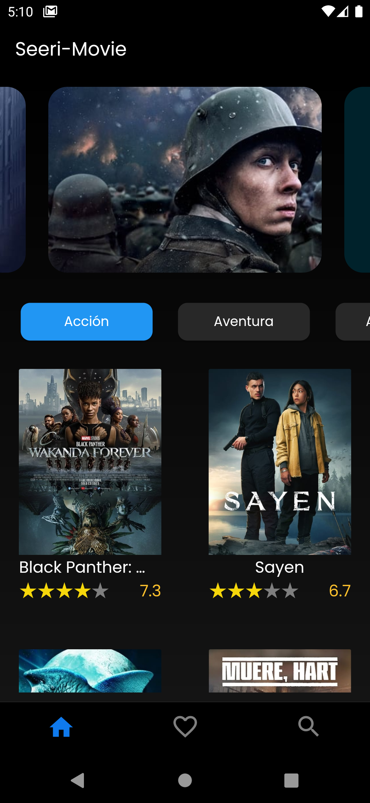
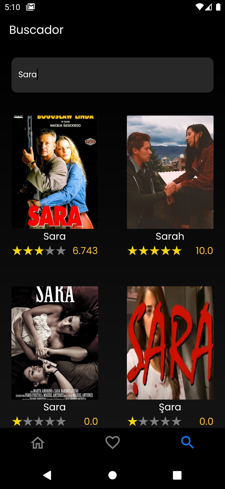
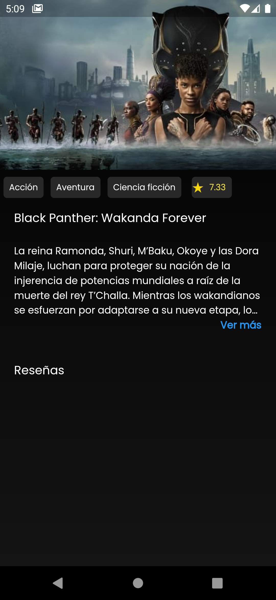

# Nombre del proyecto

Breve descripción del proyecto

## Características

- Gestor de estados BLoC
- Dependencia Injection con `get_it`
- Lectura de imágenes en formato SVG
- Validación de errores con `Either` de `dartz`
- Integración de Google Fonts

## Instalación

1. Clona este repositorio:

## Getting Started

    

This project is a starting point for a Flutter application.

A few resources to get you started if this is your first Flutter project:

- [Lab: Write your first Flutter app](https://docs.flutter.dev/get-started/codelab)
- [Cookbook: Useful Flutter samples](https://docs.flutter.dev/cookbook)

For help getting started with Flutter development, view the
[online documentation](https://docs.flutter.dev/), which offers tutorials,
samples, guidance on mobile development, and a full API reference.
# peliculas
